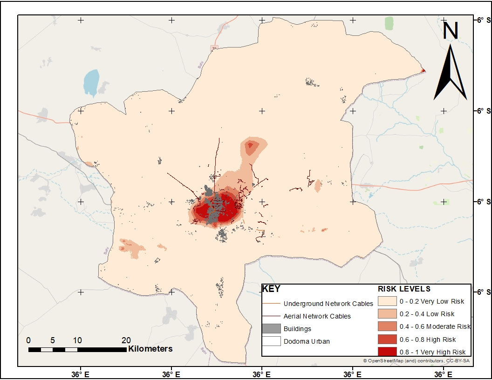
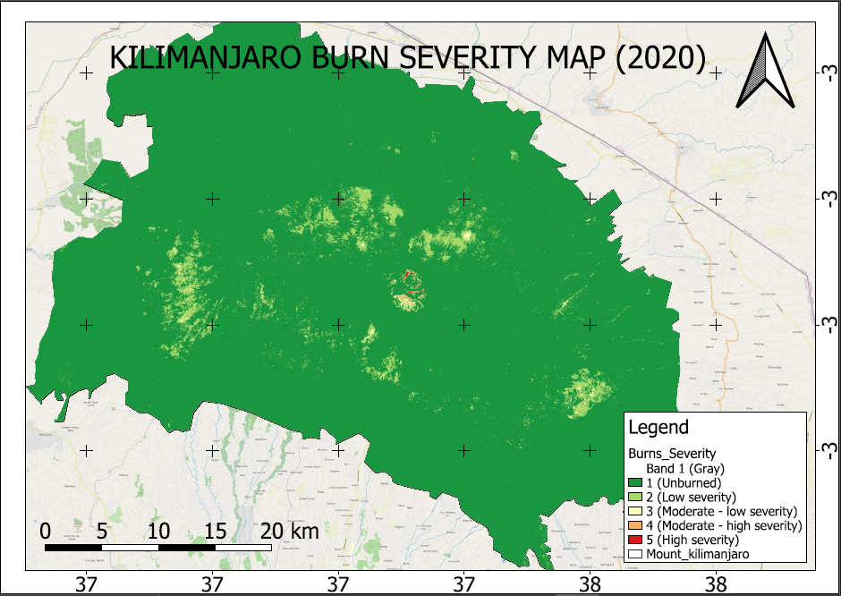
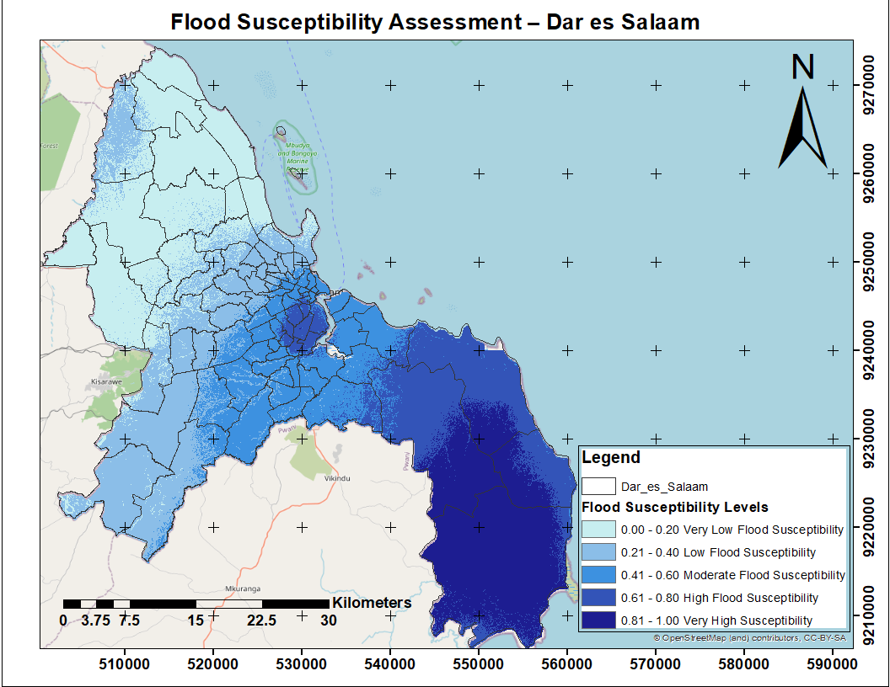
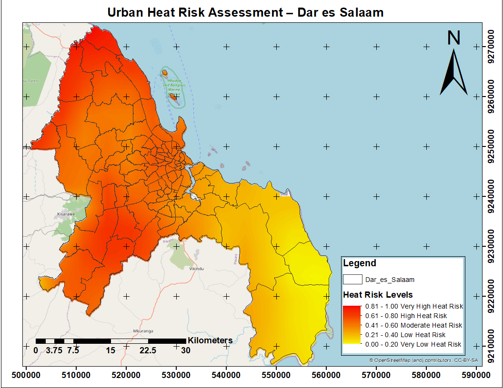
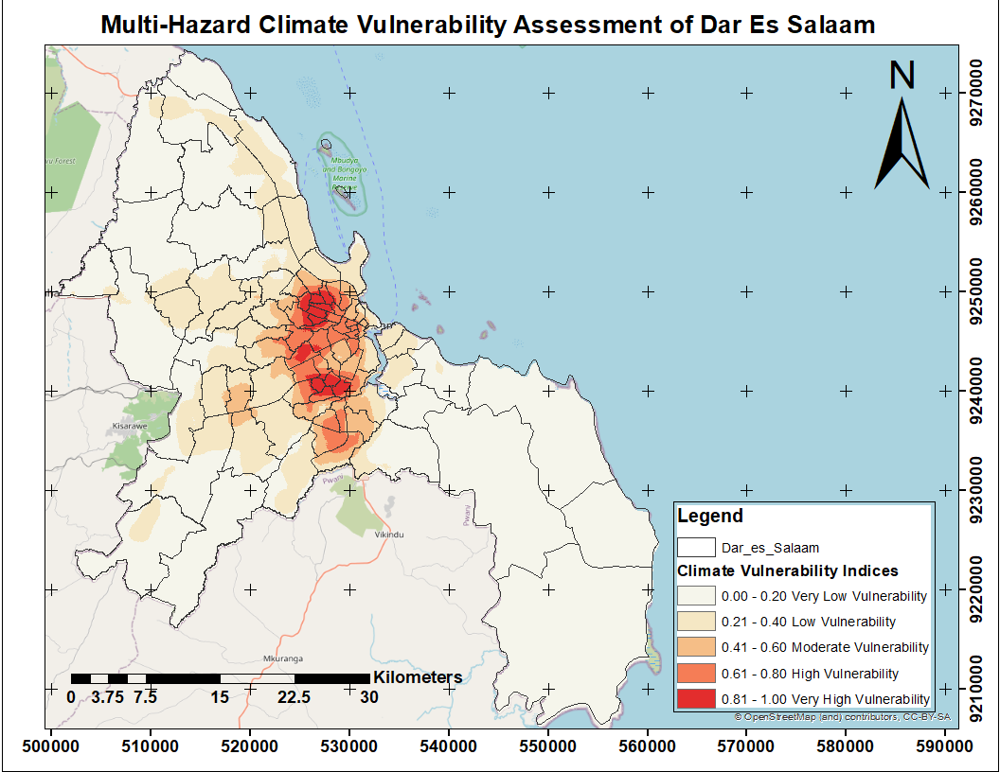

# 🌍 Geospatial Analysis Portfolio

### 📡 GIS • Remote Sensing • Spatial Data Science | Augustino Abraham

---

## 👨‍💻 About Me

I am a GIS & Remote Sensing Analyst specializing in:

- Spatial Analysis
- Predictive GIS Modeling
- Climate Risk Assessment
- Environmental Monitoring
- Remote Sensing Applications

I use geospatial technologies such as **QGIS, ArcGIS, R, and Remote Sensing data** to develop data-driven solutions for real-world environmental, urban, infrastructure, and climate-related challenges.

My work focuses on transforming spatial data into actionable insights for:
- disaster risk management
- climate resilience planning
- infrastructure analysis
- urban planning
- environmental assessment

---

# 🚀 Featured Projects

---

# 📡 1. TTCL Network Fault Prediction (Dodoma, Tanzania)

A GIS-based predictive modeling project developed to identify **high-risk zones for fiber-optic network faults**, supporting proactive infrastructure maintenance and spatial decision-making.

### 🔍 Key Highlights

- Integration of environmental and spatial datasets
- Predictive modeling using **GLM (Logistic Regression)**
- High model performance (**AUC = 0.979**)
- GIS-based fault susceptibility mapping
- Infrastructure risk visualization

### 🗺️ Preview

📂 Folder: `TTCL-Network-Fault-Prediction`

---

# 🔥 2. Burn Severity Analysis

A Remote Sensing project focused on analyzing fire-affected areas using satellite imagery and raster-based environmental assessment techniques.

### 🔍 Key Highlights

- Burn severity classification
- Raster analysis and image processing
- Environmental impact assessment
- Spatial visualization of fire intensity

### 🗺️ Preview

📂 Folder: `Burn_Severity_Analysis`

---

# 🏙️ 3. Public Facilities Hotspot Analysis (Dodoma Urban)

A spatial clustering project using **Kernel Density Estimation (KDE)** to identify concentrations of public facilities and evaluate urban accessibility patterns.

### 🔍 Key Highlights

- Spatial hotspot detection using KDE
- Urban accessibility analysis
- Spatial distribution modeling
- GIS-based density mapping

### 🗺️ Preview

📂 Folder: `Public_Facilities_Hotspot_Dodoma`

---

# 🌦️ 4. Urban Climate & Flood Vulnerability Analysis (Dar es Salaam, Tanzania)

A GIS & Remote Sensing-based climate risk assessment project integrating flood susceptibility, urban heat exposure, and multi-hazard vulnerability modeling to identify climate risk hotspots across Dar es Salaam.

### 🔍 Key Highlights

- Flood susceptibility modeling
- Urban heat risk assessment
- Climate vulnerability mapping
- Raster-based environmental modeling in R
- Multi-hazard spatial analysis
- GIS-based climate resilience assessment

---

## 🌊 Flood Susceptibility Assessment – Dar es Salaam

---

## 🔥 Urban Heat Risk Assessment – Dar es Salaam

---

## 🌍 Multi-Hazard Climate Vulnerability Assessment – Dar es Salaam

📂 Folder: `Urban_Climate_Vulnerability_Dar_es_Salaam`

---

# 🛠️ Tools & Technologies

## GIS & Spatial Analysis
- QGIS
- ArcGIS Pro
- Spatial Statistics
- Raster Analysis
- Terrain Analysis
- Spatial Modeling

## Programming & Data Science
- R Programming
- Terra Package
- SF Package
- Statistical Modeling
- Predictive Analytics

## Remote Sensing & Environmental Data
- Satellite Imagery
- SRTM DEM
- TerraClimate Data
- Environmental Raster Processing
- Climate Data Analysis

---

# 📊 What This Portfolio Demonstrates

This portfolio showcases my ability to:

- Analyze spatial and environmental datasets
- Develop GIS-based predictive models
- Perform climate and disaster risk assessments
- Apply Remote Sensing techniques to real-world challenges
- Create geospatial visualizations and thematic maps
- Build decision-support systems using spatial data science
- Integrate GIS with statistical and environmental modeling

---

# 🌐 Connect With Me

## LinkedIn
https://www.linkedin.com/in/augustino-abraham-3825673a5

## GitHub Portfolio
https://github.com/Augustino-Abraham/Geospatial-Analysis-Portfolio-Augustino-Abraham

---

# 💡 Portfolio Purpose

This portfolio was developed to demonstrate practical geospatial problem-solving skills through applied GIS and Remote Sensing projects.

The projects highlight my ability to:
- transform spatial data into actionable insights
- support evidence-based decision making
- develop environmental and infrastructure risk models
- communicate complex spatial information through maps and visual analytics

---

# 📌 Areas of Interest

- Climate Risk Assessment
- Disaster Risk Reduction
- Environmental GIS
- Urban Analytics
- Infrastructure GIS
- Spatial Data Science
- Remote Sensing Applications
- Geospatial Artificial Intelligence (GeoAI)

---
